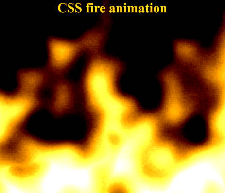

# CSS Fire Animation

Incredibly simple CSS animation, producing a very convincing fire effect.

## See it in action

https://helderman.github.io/blend-fire/html5/index.html

Works on recent versions of
[Google Chrome](https://en.wikipedia.org/wiki/Google_Chrome),
[Firefox](https://en.wikipedia.org/wiki/Firefox),
[Microsoft Edge](https://en.wikipedia.org/wiki/Microsoft_Edge),
[Opera](https://en.wikipedia.org/wiki/Opera_(web_browser)),
[Samsung Internet](https://en.wikipedia.org/wiki/Samsung_Internet).

Not tested yet on
[Safari](https://en.wikipedia.org/wiki/Safari_(web_browser));
I am all ears for your experiences there.

Does not work on
[Internet Explorer](https://en.wikipedia.org/wiki/Internet_Explorer).

## How it works

Two 'solid noise' images are continuously sliding along each other,
blended together with 'difference' blend mode.
A gradient is blended in to make the flames 'die out' as they rise.
Additional filters are giving it the right contrast and color.

## Video

https://www.youtube.com/watch?v=w3lhF7yMVfM

## Credits

This is a fork of an earlier repo of mine,
[blend-smoke](https://github.com/helderman/blend-smoke).

Image produced using [GIMP](https://en.wikipedia.org/wiki/GIMP).
Thanks to [Ken Perlin](https://en.wikipedia.org/wiki/Ken_Perlin)
for the noise algorithm.
This animation shows once more
how versatile his noise is in modelling natural phenomena.

Thanks to [Shadertoy](https://www.shadertoy.com/)
for giving me the platform to experiment with noise algorithms.
It is here that I first discovered that the sum (or difference)
of two noise functions makes a great fire.
Here's a demo I made:

https://www.shadertoy.com/view/fdtczl
